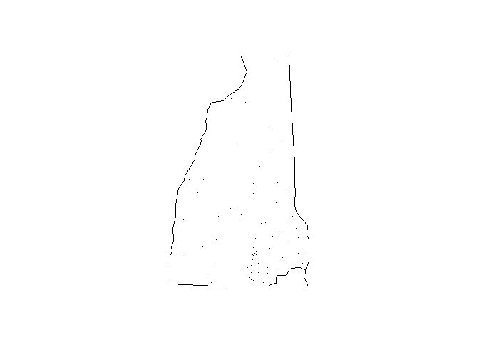

<!-- README.md is generated from README.Rmd. Please edit that file -->

# farsrr

<!-- badges: start -->

[](https://travis-ci.com/hugo7gpad/farsrr)
[](https://github.com/hugo7gpad/farsrr/actions/workflows/R-CMD-check.yaml)
<!-- badges: end -->

The goal of farsrr is to offer tools to report and analyse accidents
data over years.The farsrr package provides functions to read, summarize
and visualize data on accidents recorded by time, date, geographical
information such as: city, state, longitude, latitude… and more.

## Installation

You can install the development version of farsrr from
[GitHub](https://github.com/) with:

``` r
# install.packages("devtools")
devtools::install_github("hugo7gpad/farsrr")
```

## Example

This is a basic example which shows you how to read the accident report
data of the year 2014 into R :

``` r
library(farsrr)
make_filename(2013)
#> [1] "accident_2013.csv.bz2"
make_filename(2014)
#> [1] "accident_2014.csv.bz2"
make_filename(2015)
#> [1] "accident_2015.csv.bz2"
accident_2013_csv <- suppressMessages(readr::read_csv(system.file("extdata", 
                                                  "accident_2013.csv.bz2", package = "farsrr")))
readr::write_csv(accident_2013_csv, "accident_2013.csv.bz2")
accident_2014_csv <- suppressMessages(readr::read_csv(system.file("extdata", 
                                                  "accident_2014.csv.bz2", package = "farsrr")))
readr::write_csv(accident_2014_csv, "accident_2014.csv.bz2")
accident_2015_csv <- suppressMessages(readr::read_csv(system.file("extdata", 
                                                  "accident_2015.csv.bz2", package = "farsrr")))
readr::write_csv(accident_2015_csv, "accident_2015.csv.bz2")

fars_read("accident_2013.csv.bz2")
#> # A tibble: 30,202 × 50
#>    STATE ST_CASE VE_TOTAL VE_FORMS PVH_INVL  PEDS PERNO…¹ PERMVIT PERSONS COUNTY
#>    <dbl>   <dbl>    <dbl>    <dbl>    <dbl> <dbl>   <dbl>   <dbl>   <dbl>  <dbl>
#>  1     1   10001        1        1        0     0       0       8       8    115
#>  2     1   10002        2        2        0     0       0       2       2     55
#>  3     1   10003        1        1        0     0       0       1       1     89
#>  4     1   10004        1        1        0     0       0       3       3     73
#>  5     1   10005        2        2        0     0       0       3       3    125
#>  6     1   10006        2        2        0     0       0       3       3     97
#>  7     1   10007        1        1        0     0       0       1       1     95
#>  8     1   10008        2        2        0     0       0       2       2     49
#>  9     1   10009        1        1        0     0       0       1       1     17
#> 10     1   10010        2        2        0     0       0       4       4     51
#> # … with 30,192 more rows, 40 more variables: CITY <dbl>, DAY <dbl>,
#> #   MONTH <dbl>, YEAR <dbl>, DAY_WEEK <dbl>, HOUR <dbl>, MINUTE <dbl>,
#> #   NHS <dbl>, ROAD_FNC <dbl>, ROUTE <dbl>, TWAY_ID <chr>, TWAY_ID2 <chr>,
#> #   MILEPT <dbl>, LATITUDE <dbl>, LONGITUD <dbl>, SP_JUR <dbl>, HARM_EV <dbl>,
#> #   MAN_COLL <dbl>, RELJCT1 <dbl>, RELJCT2 <dbl>, TYP_INT <dbl>,
#> #   WRK_ZONE <dbl>, REL_ROAD <dbl>, LGT_COND <dbl>, WEATHER1 <dbl>,
#> #   WEATHER2 <dbl>, WEATHER <dbl>, SCH_BUS <dbl>, RAIL <chr>, NOT_HOUR <dbl>, …
```

Let’s find how many accidents are reported to the US NHTSA F.A.R.S’ each
month of the following years: 2013, 2014, 2015:

``` r

## Accidents reported to the US NHTSA F.A.R.S in 2013, 2014, 2015
yrs <- c(2013, 2014, 2015)

# View 2 columns MONTH, year data for each year in the list (2013, 2014, 2015)
fars_read_years(yrs)
#> [[1]]
#> # A tibble: 30,202 × 2
#>    MONTH  year
#>    <dbl> <dbl>
#>  1     1  2013
#>  2     1  2013
#>  3     1  2013
#>  4     1  2013
#>  5     1  2013
#>  6     1  2013
#>  7     1  2013
#>  8     1  2013
#>  9     1  2013
#> 10     1  2013
#> # … with 30,192 more rows
#> 
#> [[2]]
#> # A tibble: 30,056 × 2
#>    MONTH  year
#>    <dbl> <dbl>
#>  1     1  2014
#>  2     1  2014
#>  3     1  2014
#>  4     1  2014
#>  5     1  2014
#>  6     1  2014
#>  7     1  2014
#>  8     1  2014
#>  9     1  2014
#> 10     1  2014
#> # … with 30,046 more rows
#> 
#> [[3]]
#> # A tibble: 32,166 × 2
#>    MONTH  year
#>    <dbl> <dbl>
#>  1     1  2015
#>  2     1  2015
#>  3     1  2015
#>  4     1  2015
#>  5     1  2015
#>  6     1  2015
#>  7     1  2015
#>  8     1  2015
#>  9     1  2015
#> 10     1  2015
#> # … with 32,156 more rows

# Number of accidents in every month of each year in the list (2013, 2014, 2015)
fars_summarize_years(yrs)
#> # A tibble: 12 × 4
#>    MONTH `2013` `2014` `2015`
#>    <dbl>  <int>  <int>  <int>
#>  1     1   2230   2168   2368
#>  2     2   1952   1893   1968
#>  3     3   2356   2245   2385
#>  4     4   2300   2308   2430
#>  5     5   2532   2596   2847
#>  6     6   2692   2583   2765
#>  7     7   2660   2696   2998
#>  8     8   2899   2800   3016
#>  9     9   2741   2618   2865
#> 10    10   2768   2831   3019
#> 11    11   2615   2714   2724
#> 12    12   2457   2604   2781
```

Points in the following map represent locations where accidents were
reported in the state number 33 (New York) in the year 2014


